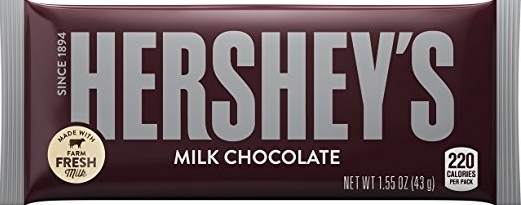
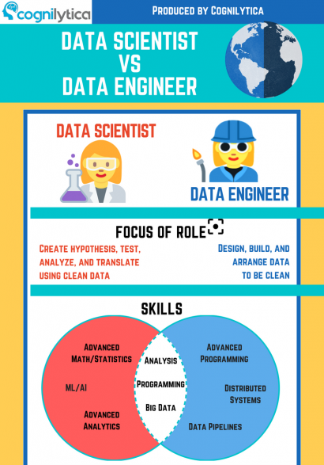

```{r setup, include=FALSE}
knitr::opts_chunk$set(echo = FALSE, warning = FALSE, fig.align  = 'center', dev.args = list(bg = 'transparent'), cache = T)
library(dplyr)
library(xtable)
library(png)
library(grid)
library(ggplot2)
data_date <- "2020_03_01"
```


# Background


<!-- - Invaluable skills -->
<!-- - Time management -->
<!-- - Self learning -->
<!-- - Communication -->

## Education {.columns-2}

<br>
```{r , fig.height=3, fig.width=5, fig.align='left'}
img <- readPNG("files/UCD_logo.png")
grid.raster(img)
```

<br><br>

- BSc (Mathematical Sciences)
- MSc (Statistics)
- PhD (Computational Statistics)
    - Prof. Nial Friel


<!-- ## Path in Industry -->


<!-- - UCD Insight Centre -->
<!--     - Postdoc Project (Industry lead research) -->
<!--         - Prof. Andrew Parnell -->
<!-- - Clavis Insight -->
<!--     - Data Scientist -->
<!--         - Startup ($\approx 200$ employees (2 data scientists)) -->
<!--         - Acquired (2017) -->
<!-- - Edge by Ascential -->
<!--     - Senior Data Scientist -->
<!--         - Large Multinational ($1000+$ employees (dept. of 13)) -->

<!-- <div class="notes"> -->
<!-- - Went from team of 2 -->
<!-- - To department of 13 -->
<!-- </div> -->


## Path in Industry - Postdoc Researcher

```{r insight centre logo, fig.height=1.6}
img <- readPNG("files/insight-centre.png")
grid.raster(img)
```

<br> 

- Insight Centre for Data Analytics (UCD)
    - Prof. Andrew Parnell
    - Supervised and Unsupervised Classification
    - Industry Lead Research


<div class="notes">
- 1 year Postdoc
- Industry specfic problem
</div>


## Path in Industry - Data Scientist

```{r clavis logo, fig.height=1.2, fig.width = 6}
img <- readPNG("files/Clavis-Insight.png")
grid.raster(img)
```

<br>

- Startup ($\approx 120$ employees)
- Ecommerce Analytics
- 2 Data Scientists
- Acquired in 2017


<div class="notes">
- Founded in 2008
- Ecommerce analytics
</div>


## Path in Industry - Senior Data Scientist

```{r edge logo 0, fig.height=1.6}
img <- readPNG("files/Edge_Logo.png")
grid.raster(img)
```

- Part of Large Multinational ($1500+$ employees)
- $500+$ employees in Edge Brand
- Data Science
    - Department of 13 People
        - Data Scientists
        - Data Engineers
        - Data Analysts

<div class="notes">
- To department of 13
</div>


## {.imageslide}

```{r ascential logo, fig.height=1.8}
img <- readPNG("files/Ascential_Logo.png")
grid.raster(img)
```

- Parent Company
    - Ascential PLC
    - Originally Publishing
        - East Midland Allied Press (EMAP)
    - Now a Global Information Company
        - Product Design
        - Marketing
        - Sales

## {.imageslide}

```{r edge logo 1, fig.height=1.8}
img <- readPNG("files/Edge_Logo.png")
grid.raster(img)
```

<br>

- Combination of 5 legacy businesses
    - Planet Retail (f.2001  - a.2007)
    - RetailNet Group (f.2006 - a.2015)
    - One Click Retail (f.2013 - a.2016)
    - **Clavis Insight (f.2008 - a.2017)**
    - Brandview (f.2008 - a.2018)

## {.imageslide}

```{r edge logo 2, fig.height=1.8}
img <- readPNG("files/Edge_Logo.png")
grid.raster(img)
```

*The Data, Insights and Advisory Solution you need to win in an ecommerce-driven world.*

- Ecommerce Analytics
    - Sales
    - Market Share
    - Content
        - In Stock
        - Ratings & Reviews
        - Product Info

    
## Some Data Science Projects in Edge

- Auto Classification
    - Classifying New Products
- User Interfaces (Shiny Apps)
    - Cleaning Data
    - Transforming Back-end Files
    - Structured Access to Databases
- Method of Matching Products (fuzzy text matching)
- Ad-hoc Projects
    - Predicting Sales Based on Various Metrics

# Auto Classification

## Problem

-  Classification of Products

<br>

- Ecommerce sites are fast moving and no two are exactly alike.
    - Different stores have different category names and structures.  
- There is a need to provide a standardized category view across multiple sites.
    - Each manufacturer has a different view of categories.
    - Need to be flexible when assigning a product to a category.

## Classification of Products

<center>

</center>

- Amazon
    - Grocery & Gourmet Food > Candy & Chocolate > Bars
- Walmart
    - Food > Candy & Gum > Chocolate


## {.imageslide}

```{r clavis sample, fig.height=6}
img <- readPNG("files/insights_example_hersheys.png")
grid.raster(img)
```


## Classification of Products

<br>

- When a new product is found on a retailer, the information is collected.
- Each new product is then classified into it's correct category.
- As a manual task this is very time consuming, error prone and requires a lot of manual intervention by users.
    - 5 hours per instance (2016)
    - 350+ instances


<div class="notes">
- Used to be 5 hours per instance
    - Currently 350+ instances
</div>


## Roadmap for Automating Classification

<br>

- Research
    - Find suitable algorithm.
- Beta testing
    - Test the algorithm within the current process.
- Integrating code
    - Build the code into the current company platform.

<div class="notes">
- This is data science!
</div>
    
    
## Supervised Classification

<br><br><br>

- Multinomial Logistic Regression (Maxent)
    - Reasonably Accurate
    - Quick

<!-- - Hierarchical -->
<!-- ```{r classifier nodes, fig.height=4} -->
<!-- img <- readPNG("files/local_classifier_per_node.png") -->
<!-- grid.raster(img) -->
<!-- ``` -->

<div class="notes">
- Also tried K-nn, Random Forests.
- One thing to pick a suitable algorithm.
    - Need to put it in production.
</div>

## Shiny App {.wordcloud}

```{r autoc shiny image, fig.height=6}
img <- readPNG("files/shiny_example1.png")
grid.raster(img)
```

<div class="notes">
- User friendly
- Quick

- Not fully automated
</div>


## Plumber API

<br>

- The **plumber** library is used to allow code to be called using an API.
    - Most computing languages can call API's.
    - Arguments in the API point the R code to the database containing the new data.
    - R code classify’s the new data and updates the database with the new categories.

## Plumber API {.imageslide}

```{r plumber1, fig.height=6}
img <- readPNG("files/Rflow_1.png")
grid.raster(img)
```

<div class="notes">
- First the Java code does some pre processing
- Then writes the data to a temp DB
- An server with the R code is spun up
- Call with customer info and temp DB address
</div>


## Plumber API {.imageslide}

```{r plumber2, fig.height=6}
img <- readPNG("files/Rflow_2.png")
grid.raster(img)
```

<div class="notes">
- The R server pulls in the data
- Trains
- Classifies
</div>


## Plumber API {.imageslide}

```{r plumber3, fig.height=6, fig.retina = 5}
img <- readPNG("files/Rflow_3.png")
grid.raster(img)
```

<div class="notes">
- Finally the R server writes the classifications to the temp DB
- Sends message to let the Java server know it has finished
</div>


## More Info (Poster from CASI 2018)


<br><br><br><br>
<center>
<font size="9">
[casi.aboland.ie](http://casi.aboland.ie/)
</font> 
</center>

<div class="notes">
- Poster from CASI 2018
</div>


# 'Data Science'

## Data Science

- What does it mean?

- Disciplines
    - Statistics
    - Computer Science

- Skill sets
    - Analytics/Statistics
    - ETL (Extract Transform Load)
    - Automation (ML)


<div class="notes">
- Sometimes very very simple techniques
</div>


## Data Science

<br><br><br><br>
<center>
<font size="10">
Working with data!
</font> 
</center>


## Job Titles

<br><br>

- Statistician
- Data Analyst
- Data Scientist
- Data Engineer

<div class="notes">
- All deal with data
- Different specialities
</div>


## Different Disciplines

<br>

- Statistics
    - Statistical Algorithms "Machine Learning"
    - Descriptive Statistics
    - Visualisation

- Computer Science
    - Implementing Statistical Algorithms
    - Efficient Management of Data (ETL)


## Data Scientist

(Formerly a catch all role)

<br><br>

- A data scientist will have excellent understanding of statistical methods
- Is able to test and implement methods but does not specialise in this 

<center>
*(Statistician)*
</center>


## Data Engineer

<br><br><br>

- A data engineer specialises in implementing techniques
- Understands the basics of the methods but is not a expert


<!-- ## Workflow -->

<!-- - Research Methods -->
<!--   - **Statistical Methods** -->

<!-- - -->
<!-- - Automated Workflows -->

<!-- - Remove Manual Touch -->
<!--     - Excel -->
<!--     -  -->


<!-- ## Enabling Analytics -->

<!-- - Bringing simple techniques -->


<!-- ## Real Life (Day to Day) -->

<!-- - 30% Admin -->
<!--     - Emails -->
<!--     - Answering IM -->
<!-- - 40% Development -->
<!--     - Coding -->
<!--     - Testing methods -->
<!-- - 30% Managing Infrastructure -->


## {.imageslide}

```{r DSvsDE1, fig.height=6}
img <- readPNG("files/DSvsDE1.png")
grid.raster(img)
```
<!--  -->


##

```{r DSvsDE2, fig.height=6}
img <- readPNG("files/DSvsMLEvsDE.png")
grid.raster(img)
```


# Demand for Statisticians


## Statisticians

<br><br><br><br>

- Is statistics still recognised as being important


<div class="notes">
- It is, but do people still think that?
</div>


## LinkedIn Job Adverts

<br>

- Experiment
    - `r format(as.Date("2020_03_01", format = "%Y_%m_%d"), "%d %B %Y")`
    - 4 search terms used: 'Statistician', 'Data Scientist', 'Statistics', 'Data Science'.


## Load Webpage  {.smaller}


```{r scrape site step1, eval=FALSE, echo=TRUE}
library(RSelenium)
rd <- rsDriver(browser = "firefox", port = 4444L)  # Download binaries, start driver
my_session <- rd$client # Create client object
my_session$open()  # Open session

search_terms <- c("Data%20Scientist", "Data%20Science", "Statistics", "Statistician"); term = 1
my_session$navigate(  # Navigate to the page
  paste0("https://ie.linkedin.com/jobs/search?keywords=", search_terms[term], 
         "&location=Dublin%2C%20Ireland&trk=guest_job_search_jobs-search-bar_search-submit&
         redirect=false&position=1&pageNum=0"))
```

```{r , fig.height=3}
img <- readPNG("files/li_step1.png")
grid.raster(img)
```


<div class="notes">
- Need to start a browser session
- Load desired page
</div>


## Reveal All Jobs  {.smaller}

```{r scrape site step2, eval=FALSE, echo=TRUE}
for (i in 1:20) {  # Loop and click "Load more jobs" button
  btn_available <-   # Check if button still exists 
    tryCatch({
      load_btn <- 
        my_session$findElement(using = "css selector", ".see-more-jobs")
      TRUE
      },error = function(e) FALSE)
  if(!btn_available) break  # End loop if no button
  load_btn$clickElement()  # Click button
  Sys.sleep(runif(1, 3, 5))  # Random wait between 3 and 5 seconds
}
```


```{r , fig.height=3}
img <- readPNG("files/li_step2.png")
grid.raster(img)
```


<div class="notes">
- Button must be clicked multiple times to load all data
</div>


## Save Data  {.smaller}

<br><br><br>

```{r scrape site step3, eval=FALSE, echo=TRUE}
my_session$getPageSource()[[1]] %>% # Get HTML and save Data
  writeLines(paste0("data/", format(Sys.time(), "%Y_%m_%d"), "_LI_", 
                    gsub("%20", "_", search_terms[term]), "_Dublin.txt"))  
my_session$close() # Close session
rd[["server"]]$stop()  # stop driver
```

<div class="notes">
- Save the data
</div>


## Parse Data {.smaller}

```{r parse job data new, echo = TRUE, eval = TRUE, cache = TRUE}
lapply(c("Statistician", "Data_Scientist", "Statistics", "Data_Science"),
       function(jobtitle){
         paste0("data/2020_03_01_LI_", jobtitle, "_Dublin.txt") %>%  # Filename
           xml2::read_html() %>%  # Read in data as HTML
           lapply(X = 1:700, FUN = function(job_i, raw_html = .){  # Parse Initial HTML
             raw_html %>% rvest::html_nodes(xpath = paste0('/html/body/main/div/section/ul/li[', job_i,']'))
           }) %>%
           lapply(function(main_html){  # Parse sub elements of HTML
             c(main_html %>% rvest::html_nodes(xpath = 'a') %>%  # Title
                 rvest::html_text() %>% ifelse(test = length(.) > 0, ., NA),
               main_html %>%  rvest::html_nodes(xpath = 'div[1]/h4/a') %>%  # Company
                 rvest::html_text() %>% ifelse(test = length(.) > 0, ., NA),
               main_html %>% rvest::html_nodes(xpath = 'div[1]/div') %>%  # Description
                 rvest::html_text( ) %>% ifelse(test = length(.) > 0, ., NA),
               jobtitle)
             }) %>% 
           do.call(what = rbind, .)  # Combine data for each term
       }) %>%
  do.call(rbind, .) %>%  # Combine 3 data sets
  as.data.frame(stringsAsFactors  = F) %>%  # Create data frame
  dplyr::select(Title = V1, Company = V2, Text = V3, SearchTerm = V4) %>%  # Rename variables
  dplyr::filter(!is.na(Title)) -> job_data  # Remove NA's
```


## LinkedIn Job Adverts {.build}

```{r}
job_data$Time <- sapply(job_data$Text, function(x) strsplit(x, "[.][.][.]")[[1]][1])
job_data$Text <- sapply(job_data$Text, function(x) strsplit(x, "[.][.][.]")[[1]][1])
```

- `r format(as.Date("2020_03_01", format = "%Y_%m_%d"), "%d %B %Y")`
- 4 search terms used: 'Statistician', 'Data Scientist', 'Statistics', 'Data Science'.

> - Total of `r unique(job_data$Text) %>% length()` unique jobs returned.


<center>
```{r search_results, results='asis'}

job_data %>% 
  group_by(SearchTerm) %>%
  summarise(Results = length(SearchTerm)) %>%
  select(`Search Term` = SearchTerm, Results) %>%
  arrange(Results) %>%
  xtable() %>%
  print(type = "html", include.rownames = F, comment = F)  # html.table.attributes = 'align="center", width=50%'
```
<center/>


<!-- ## Job Titles -->
```{r job titles table, cache = F, include = F, eval = F}

available_choices = as.list(c("All", unique(job_data$SearchTerm)))
names(available_choices) <- c("All", gsub("_", " ", unique(job_data$SearchTerm)))

# inputPanel(
  fluidRow(
    column(3,
           textInput("job_search_term", label = "Term", value = "Data")
           ),
    column(7, offset = 1, 
           radioButtons("search_term", label = "Search Filter", 
              choices = available_choices, 
              inline = TRUE)
           )
  )
  # selectInput("search_term", label = "Search Filter", 
  #             choices = list("All" = "All",
  #                            "Statistician" = "Statistician", 
  #                            "Data Scientist" = "DataScientist", 
  #                            "Statistics" = "Statistics"))
  
# )

number_to_display <- 
  reactive({
    if (input$search_term == "All") {
      job_data %>% 
        distinct(Text, .keep_all = TRUE) %>%
        pull(Title) %>%
        tolower() %>%
        grepl(pattern = tolower(input$job_search_term), x = .) %>%
        sum() %>%
        return()
    }else{
      job_data %>%
        filter(SearchTerm == input$search_term) %>%
        distinct(Text, .keep_all = TRUE) %>%
        pull(Title) %>%
        tolower() %>%
        grepl(pattern = tolower(input$job_search_term), x = .) %>%
        sum() %>%
        return()
    }
  })

br()
renderText({
  paste0(
    "Number of jobs with term in title : ", 
    # job_data$Title %>% 
    #   tolower() %>%
    #   grepl(pattern = tolower(input$job_search_term), x = .) %>%
    #   sum(),
    number_to_display()
    
  )
})


obs_with_term <- 
  reactive({
    if (input$search_term == "All") {
      job_data %>% 
        distinct(Text, .keep_all = TRUE) %>%
        filter(grepl(pattern = tolower(input$job_search_term), x = tolower(.$Title))) %>%
        group_by(Title) %>%
        tally(name = "Count") %>%
        arrange(desc(Count)) %>%
        return()
    }else{
      job_data %>% 
        filter(SearchTerm == input$search_term, grepl(pattern = tolower(input$job_search_term), x = tolower(.$Title))) %>%
        distinct(Text, .keep_all = TRUE) %>%
        group_by(Title) %>%
        tally(name = "Count") %>%
        arrange(desc(Count)) %>%
        return()
    }
  })

br()
DT::renderDataTable(
  obs_with_term(),
  options = list(pageLength = 5, dom = 't'),
  rownames = FALSE
  )

```


## Job Titles

```{r job titles table static, cache = F}

job_data %>% 
  # tidyr::separate(Text, col = c("Text", "Time"), sep = "[.][.][.]") %>%
  distinct(Text, .keep_all = TRUE) %>%
  group_by(Title) %>%
  tally(name = "Count") %>%
  arrange(desc(Count)) %>%
  DT::datatable(
    options = list(pageLength = 8, dom = 'ftp'),
    rownames = FALSE
  )
```


<!-- ## Job Titles (Statistician) -->

<!-- ```{r job titles table static s1, cache = F} -->

<!-- job_data %>%  -->
<!--   distinct(Text, .keep_all = TRUE) %>% -->
<!--   filter(SearchTerm == "Statistician") %>% -->
<!--   group_by(Title) %>% -->
<!--   tally(name = "Count") %>% -->
<!--   arrange(desc(Count)) %>% -->
<!--   DT::datatable( -->
<!--     options = list(pageLength = 5, dom = 't'), -->
<!--     rownames = FALSE -->
<!--   ) -->

<!-- ``` -->


# Word Clouds (Job Descriptions)

```{r, include=FALSE}
# http://www.sthda.com/english/wiki/text-mining-and-word-cloud-fundamentals-in-r-5-simple-steps-you-should-know
library("tm")
library("SnowballC")
library("wordcloud")
library("RColorBrewer")

my_dtm_func <- function(data, filter_term){
  text <- data %>%
    filter(SearchTerm == filter_term) %>%
    pull(Text) %>%
    gsub(pattern = ", IE|, Ireland", replacement = " ", x = .)
  docs <- Corpus(VectorSource(text))
  # inspect(docs)
  
  toSpace <- content_transformer(function(x , pattern ) gsub(pattern, " ", x))
  docs <- tm_map(docs, toSpace, "/")
  docs <- tm_map(docs, toSpace, "@")
  docs <- tm_map(docs, toSpace, "\\|")
  docs <- tm_map(docs, toSpace, "–")
  
  docs <- tm_map(docs, toSpace, "’")
  

  # Convert the text to lower case
  docs <- tm_map(docs, content_transformer(tolower))
  # Remove numbers
  docs <- tm_map(docs, removeNumbers)
  # Remove english common stopwords
  docs <- tm_map(docs, removeWords, stopwords("english"))
  # Remove your own stop word
  # specify your stopwords as a character vector
  docs <- tm_map(docs, removeWords, 
                 c("county", "dublin", "leinster", "years’", "years", "months", "month", 
                   "weeks", "week", "days", "ago", "agoeasy", "easy", "skills",
                                      "looking", "seeking", "experience", "will", "join", "currently",
                                      "candidate", "client", "apply", "ideally", "need", "dublinheads",
                                      "you", "’re", "you're", "like", stopwords("en"))) 
  # Remove punctuations
  docs <- tm_map(docs, removePunctuation)
  # Eliminate extra white spaces
  docs <- tm_map(docs, stripWhitespace)
  
  
  dtm <- TermDocumentMatrix(docs)
  m <- as.matrix(dtm)
  v <- sort(rowSums(m),decreasing = TRUE)
  d <- data.frame(word = names(v),freq = v)
  # head(d, 10)
  return(d)
}
```


## Statistician {.wordcloud}

```{r statistician wordcloud, out.height="90%", fig.width=7, fig.height=6, fig.retina=4, cache = T}
d1 <- my_dtm_func(job_data, filter_term = 'Statistician')
set.seed(12, kind = "Mersenne-Twister", normal.kind = "Inversion", sample.kind = "Rejection")
wordcloud(words = d1$word, freq = d1$freq, min.freq = 1,
          max.words = 200, random.order = FALSE, rot.per = 0.35, 
          colors = brewer.pal(8, "Dark2"))
```


## Data Scientist {.wordcloud}

```{r data scientist wordcloud, out.height="90%", fig.width=7, fig.height=6, fig.retina=3, cache = T}
d2 <- my_dtm_func(job_data, filter_term = 'Data_Scientist') #%>%
  # filter(freq > 10) 
# d2$freq <- d2$freq - 10
# d2$freq[1] <- d2$freq[1]-100
# d2$freq <- ceiling(d2$freq/(max(d2$freq)/10))
set.seed(12)
wordcloud(words = d2$word, freq = d2$freq, min.freq = 0,
          max.words = 200, random.order = FALSE, rot.per = 0.35, 
          colors = brewer.pal(8, "Dark2"), scale = c(8, 0.5))
```


## Statistics {.wordcloud}

```{r statistics wordcloud, fig.width=6, fig.height=6, fig.retina=3, cache = T}
d3 <- my_dtm_func(job_data, filter_term = 'Statistics')
set.seed(1234)
wordcloud(words = d3$word, freq = d3$freq, min.freq = 3, #scale=c(4,1.5),
          max.words = 200, random.order = FALSE, rot.per = 0.35, 
          colors = brewer.pal(8, "Dark2"))
```


## Data Science {.wordcloud}

```{r data science wordcloud, fig.width=6, fig.height=6, fig.retina=3, cache = T}
d3 <- my_dtm_func(job_data, filter_term = 'Data_Science')
set.seed(12345)
wordcloud(words = d3$word, freq = d3$freq, min.freq = 3, #scale=c(4,1.5),
          max.words = 200, random.order = FALSE, rot.per = 0.35, 
          colors = brewer.pal(8, "Dark2"), scale = c(8, 0.2))
```


## Thank you

<br>

- `r icon::fa("linkedin")` [ linkedin.com/in/aidanboland](https://www.linkedin.com/in/aidanboland)  
- `r icon::fa("twitter")` [ \@BolandAi](https://twitter.com/BolandAi)  
- `r icon::fa("github")` [ github.com/aboland](https://github.com/aboland)  
- `r icon::fa("link")` [ aboland.ie](http://aboland.ie/)

<br>

- `r icon::fa("link")` [github.com/aboland/Young_ISA_2019/tree/NUIM_March2020](https://github.com/aboland/Young_ISA_2019/tree/NUIM_March2020)
   - presentation.Rmd


# Tips/Tricks Learned While Making This Presentation

## R Markdown Graphs {.smaller}

````
`r ''````{r}
ggplot(mpg ,aes(displ, cty, colour = class)) +
  geom_point()
```
````
```{r plot retina 1, fig.retina = 0.8, fig.height = 4, dev.args = list(bg = 'white')}
ggplot(mpg ,aes(displ, cty, colour = class)) +
  geom_point() + 
  labs(title = "Engine Size vs City Miles Per Gallon", x = "Engine Size (Litres)", y = "City MPG", colour = "Car Type") +
  theme(text = element_text(size = 17),
    plot.background = element_rect(fill = "transparent", color = NA))
```


## R Markdown Graphs {.smaller}

````
### <b>
`r ''````{r, fig.retina = 4, dev.args = list(bg = 'transparent')}
### </b>
ggplot(mpg ,aes(displ, cty, colour = class)) +
  geom_point() + theme(plot.background = element_rect(fill = "transparent", color = NA))
```
````
```{r plot retina 3, fig.retina = 4, fig.height = 4}
# ggplot(cars) + 
# geom_line(aes(x = speed, y = dist), colour = "steelblue") +
ggplot(mpg ,aes(displ, cty, colour = class)) +
  geom_point() + 
  labs(title = "Engine Size vs City Miles Per Gallon", x = "Engine Size (Litres)", y = "City MPG", colour = "Car Type") +
  theme(text = element_text(size = 17),
    plot.background = element_rect(fill = "transparent", color = NA), # bg of the plot
    # legend.background = element_rect(fill = "transparent"), # get rid of legend bg
    # legend.box.background = element_rect(fill = "transparent")
    )
```


